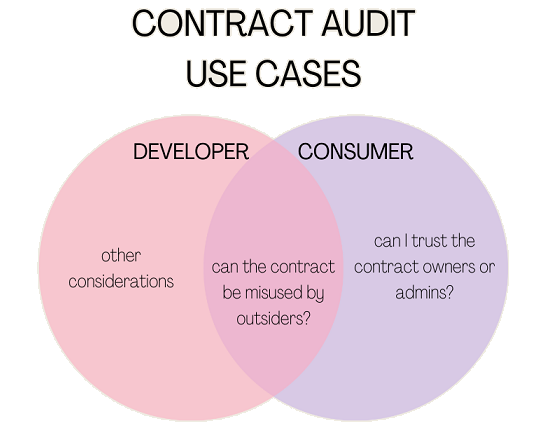

# The Moo of Moo

# Intro
The immutability of a smart contract is essential to its usefulness; as a legal contract is - with some limited and reasonable exceptions - immutable once signed, so too must a blockchain contract be, in order to take the place of a legal contract as a form of digital law. This immutability is can also be a vulnerability, in that it's so much more difficult to remedy a security vulnerability founds in the wild after the contract's deployment. 

From the point of view of the contract developer, the immutable nature of the smart contract increases the importance of the pre-deployment security assessment, as it may be the last chance to take any meaningful action against security vulnerabilities in the contract. In the case of contracts which handle significant amounts of currency, the gravity of the security assessment is further compounded. 

Similarly, from the point of view of a potential contract consumer, a security audit is necessary before committing to usage of the contract. Just as one should read a legal or business contract fully and carefully, considering every angle and possibility, before signing the contract, a smart contract user must consider the implications of the contract's code carefully. TODO: add another sentence. 

__The use cases covered by this article:__ 
- you are a developer of a smart contract, and you want to ensure that your creation is as secure against conventional code-based attacks as possible. 
- you are a potential consumer of a smart contract, and you want to ensure - before committing funds to the contract's custody - that it is reasonably safe from conventional shenanigans, tomfoolery, and hullabaloo. 

__Use cases not covered:__ This article considers security from a developer's perspective only, and so will ignore things like social engineering, phishing, and the like. This article will also not cover the actual technical mechanics of auditing the smart contract, e.g. obtaining the bytecode and/or ABI, decompiling and comparing with source code, etc. Those details can be easily 

TODO: will stick to EThereum

- Scan, Explore, Secure 
